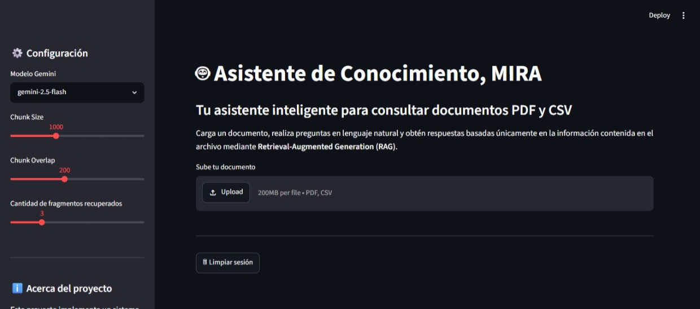
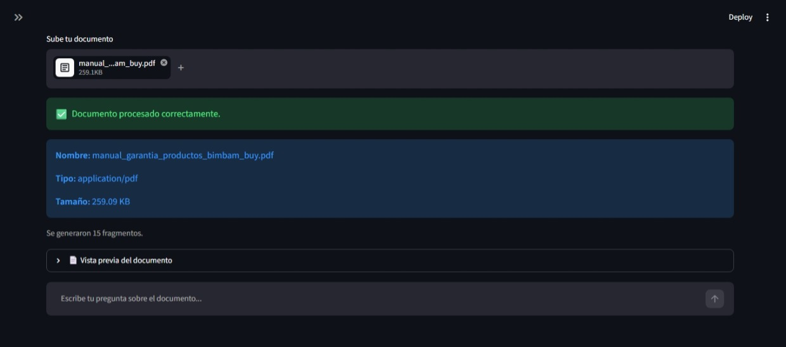
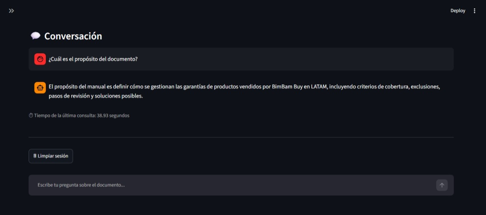
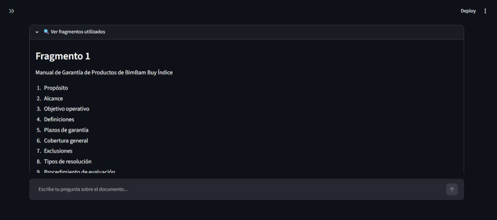
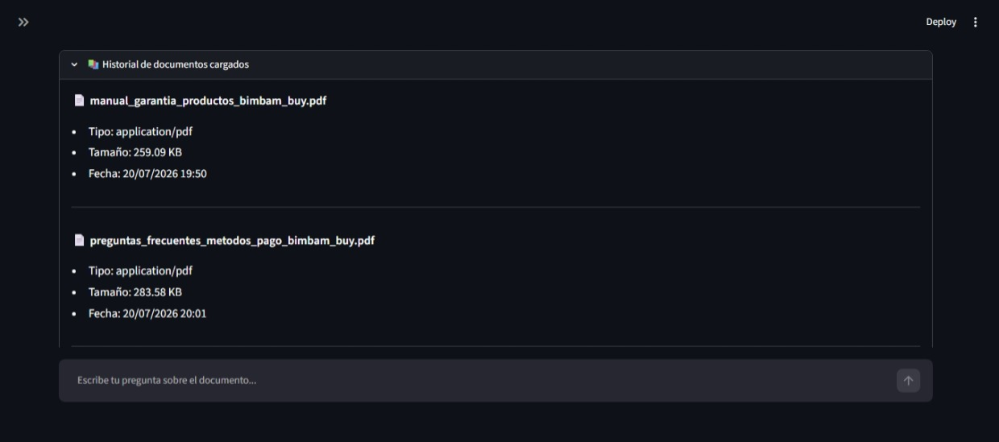

# 🤖 MIRA - Asistente Inteligente para Consulta de Documentos

MIRA es un asistente inteligente desarrollado como parte del **Challenge Alura - Agentes Inteligentes**.

La aplicación utiliza la arquitectura **Retrieval-Augmented Generation (RAG)** para responder preguntas basándose únicamente en el contenido de documentos PDF y CSV cargados por el usuario.

---

## 🚀 Características

- 📄 Carga de documentos PDF y CSV.
- 🧠 Procesamiento automático del contenido.
- ✂️ División inteligente del documento en fragmentos (chunks).
- 🔍 Recuperación semántica mediante ChromaDB.
- 🤖 Respuestas generadas con Google Gemini.
- 💬 Historial de preguntas y respuestas.
- 📚 Historial de documentos cargados.
- ⚙️ Configuración dinámica del modelo y parámetros RAG.
- ⏱ Medición del tiempo de respuesta.
- 🔍 Visualización de los fragmentos utilizados para responder.

---

# 🏗 Arquitectura

```
               ┌───────────────────────┐
               │      Usuario          │
               └──────────┬────────────┘
                          │
                          ▼
                 Streamlit (UI)
                          │
                          ▼
             Procesamiento del documento
                          │
                          ▼
        RecursiveCharacterTextSplitter
                          │
                          ▼
          Gemini Embeddings (Google)
                          │
                          ▼
                  Chroma Vector Store
                          │
                          ▼
            Recuperación de contexto
                          │
                          ▼
                 Prompt RAG
                          │
                          ▼
                Gemini 2.5 Flash
                          │
                          ▼
                    Respuesta
```

---

# 🛠 Tecnologías utilizadas

| Tecnología | Uso |
|------------|-----|
| Python | Lenguaje principal |
| Streamlit | Interfaz web |
| LangChain | Orquestación del flujo RAG |
| Google Gemini | Modelo LLM |
| ChromaDB | Base de datos vectorial |
| Pandas | Procesamiento de CSV |
| PyPDF | Lectura de PDF |
| python-dotenv | Variables de entorno |

---

# 📂 Estructura del proyecto

```
mira-agent-challenge/
│
├── app.py
├── requirements.txt
├── README.md
├── .env.example
├── .gitignore
│
└── src/
    ├── __init__.py
    ├── ingestion.py
    ├── processor.py
    ├── llm.py
    └── prompts.py
```

---

# ⚙️ Instalación

## 1. Clonar el repositorio

```bash
git clone https://github.com/jbena22/mira-agent-challenge.git
```

## 2. Entrar al proyecto

```bash
cd mira-agent-challenge
```

## 3. Crear un entorno virtual

Windows

```bash
python -m venv venv
venv\Scripts\activate
```

Linux / Mac

```bash
python3 -m venv venv
source venv/bin/activate
```

## 4. Instalar dependencias

```bash
pip install -r requirements.txt
```

---

# 🔑 Configuración

Crear un archivo `.env`

```text
GOOGLE_API_KEY=TU_API_KEY
```

---

# ▶️ Ejecutar la aplicación

```bash
streamlit run app.py
```

---

# 💬 Ejemplos de preguntas

## Para un PDF

- ¿Cuál es el objetivo del documento?
- Resume el contenido.
- ¿Quién es el autor?
- ¿Cuáles son las conclusiones?

## Para un CSV

- ¿Cuántos registros contiene?
- ¿Qué columnas existen?
- Resume la información.
- ¿Cuál es el promedio de una columna?

---

# 🔄 Flujo RAG

El funcionamiento de MIRA sigue el siguiente proceso:

1. El usuario carga un documento.
2. Se extrae el contenido.
3. El texto se divide en fragmentos.
4. Se generan embeddings.
5. Se almacenan en ChromaDB.
6. El usuario realiza una pregunta.
7. Se recuperan los fragmentos más relevantes.
8. Se construye el contexto.
9. Gemini genera la respuesta utilizando únicamente dicho contexto.

---

## 🏠 Pantalla principal



---

## 📄 Documento cargado



---

## 💬 Consulta



---

## 🔍 Recuperación de contexto



---

## 📚 Historial



---

# 🚀 Posibles mejoras

- Soporte para Word y Excel.
- Procesamiento de múltiples documentos.
- Historial persistente.
- Exportación de respuestas.
- Autenticación de usuarios.
- Despliegue con Docker.
- Integración con bases de datos vectoriales remotas.

---

# 👨‍💻 Autor

**Jhonattan Benavides**

Proyecto desarrollado para el **Challenge Alura - Agentes Inteligentes**.